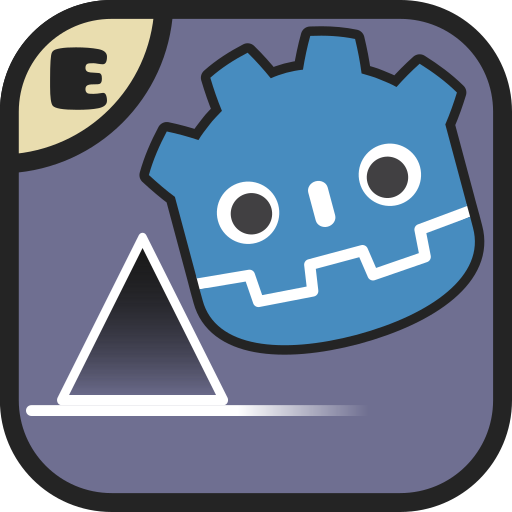

## Setup:
cargo build

 </img>
 <h1 align="center">Godot Dash V2</h1>

A Geometry Dash fangame made with Godot Engine.

[Discord community](https://discord.gg/8Vn9qDDXZD/)

## OS Support

Godot Dash V2 is intended to work on Linux, Windows, and Android.

## Downloads

<!-- Head to the [releases](https://codeberg.org/godot-dash/godot-dash/releases/) section and download the latest one. -->

As of right now, the game doesn't have any releases.
This is because it doesn't have any playable levels (the levels the game currently has are for testing purposes), and because the editor isn't finished.
Godot Dash V2 will start getting pre-releases as soon as the editor is completely usable (even if most objects from Geometry Dash are missing).

## Compilation

**⚠️ Make sure to use Godot 4.6. ⚠️**

### Dependencies

- [`git-lfs`](https://github.com/git-lfs/git-lfs#installing) (prebuilt binaries) or [`just`](https://just.systems/) and [`cargo`](https://rustup.rs/) (manual compilation)

### Instructions

- If using `git-lfs`, run `git lfs install` if you haven't done so already.
- Clone the repo locally (required for `git-lfs`) or download the source code as a zip from the releases.
- Import the project.godot file (if you cloned the repo) or the source code zip (if you downloaded it from the releases).
- If using `just`, navigate to `<repo>/rust/` and run `just build-debug` if you plan on playing through the editor and/or `just build-release` if you plan on exporting the project.
- Do `Project → Reload current project` to load the Rust extensions.
- Go to `Project → Export` and select the export preset you want.
- Choose an export path.
- Hit `Export Project`.

## Contributing

**⚠️ Make sure to use Godot 4.6. ⚠️**

### Dependencies

- [`git-lfs`](https://github.com/git-lfs/git-lfs#installing) (prebuilt binaries) or [`just`](https://just.systems/) and [`cargo`](https://rustup.rs/) (manual compilation)

### Instructions

- **Read [CONTRIBUTING.md](./CONTRIBUTING.md).**
- If using `git-lfs`, run `git lfs install` if you haven't done so already.
- Clone the repo and import it in Godot.
- If using `just`, navigate to `<repo>/rust/` and run `just build-debug` if you plan on playing through the editor and/or `just build-release` if you plan on exporting the project.
- Do `Project → Reload current project` to load the Rust extensions.
- Open a PR with your changes.
